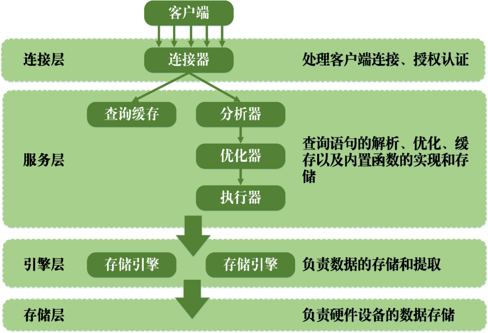

# mysql

## Index
1. [optimizer](./optimizer.md)
2. [schema](./schema.md)
3. [trx](./trx.md)
4. [engine](./engine.md)
5. [mvcc](./mvcc.md)
6. [log](./log.md)
7. [concurrent](./concurrent.md)

## Architecture

