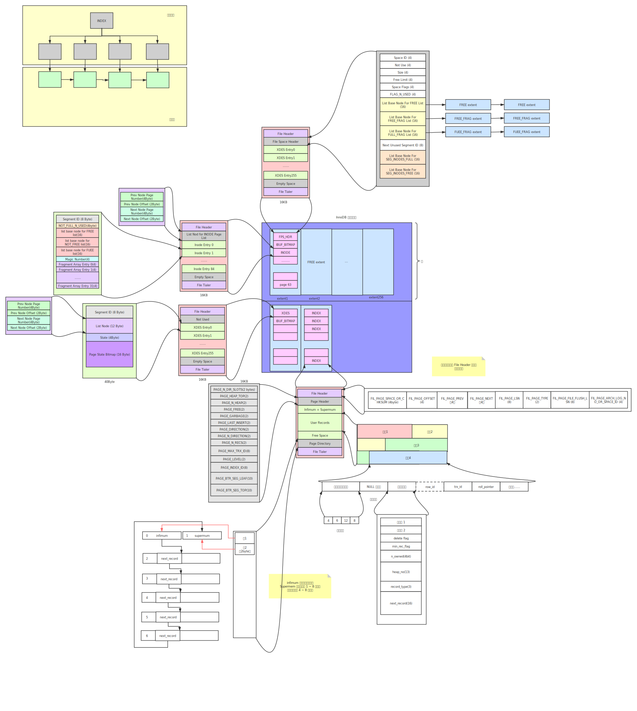

# engine

## INDEX
#### 类型：
+ B+树(数据在叶子节点，叶子节点有前后数据的指针)
+ 哈希
+ 全文

#### 为什么InnoDB默认选择B+树作为底层结构
1. 选择哈希索引在精确查找时，如果命中索引的话，查询效率最高，但是如果是范围索引的话需要扫描全表。
2. 选择B+树作为默认索引的话，对于100w的数据，如果每个叶节点存100个数据，只需要查找3次节点就能找到要的数据。
   由于每个叶节点存在前后叶子节点的指针，对于范围查找的话，及其方便。
   而选择红黑树做为索引结构的话，树的高度比选择B+树高很多，需要查找几十次才能找到要的数据。    
3. 数据库的 查/改比 在 10:1，所以维护一个B+树是很有意义的。

## MYISAM
#### 特点：
+ 不支持事务
+ 不支持外键
+ 最小锁力度为表锁
+ 非聚簇索引
+ frm(表)，myd(数据)，myi(索引)
+ 支持全文索引

#### 非聚簇索引（数据与索引分开存储）
+ 查找数据需要先根据索引找到数据的指针(myi)，然后去myd文件查找数据

## INNODB
#### 特点：
+ 支持事务
+ 支持外键
+ 最小锁力度为行锁
+ 聚簇索引
+ frm(表)，ibd(数据+索引)（mysql 8.0 已经没有frm了，和入了ibd）
+ $ sudo ls -al /usr/local/mysql/data/<database>
+ $ sudo xxd /usr/local/mysql/data/<database>/<table_name.ibd>

#### 非聚簇索引（数据与索引一起存储）
+ 聚簇索引默认选择主键，如果没有主键选择唯一非空索引，都没有的话，再生成GEN_CLUST_INDEX作为聚簇索引
+ 数据保存在主索引树上
+ 辅助索引只保存，主索引的值，所以如果选择辅助索引作为查询的话，需要查询两次索引
+ select * 必定会查询两次索引，而select id，index的话只需要查询一次辅助索引就行了（覆盖索引）

#### InnoDB索引在磁盘的存储
+ 页是innodb最小的存储空间(16kb)
+ 一个空表，idb文件就占了7个页（预分配）
+ 在表中数据非常多时，如果继续以页为单位分配，就可能造成页与页间的物理距离过大（更大的随机I/O，磁盘寻道）。
  为了尽量避免这种情况，InnoDB会尽量让逻辑上相连的页在物理内存上也连续（顺序IO）。
  当表中的数据量很大时，就以更大的 区（extent）为单位为表分配存储空间，InnoDB 规定连续的 64 个页是一个区(1M)。
  
[参考](https://junebao.top/#/detail/94)  
[参考](https://blog.nowcoder.net/n/15c92020835d4efcb4b18d61ddfd3399)  

