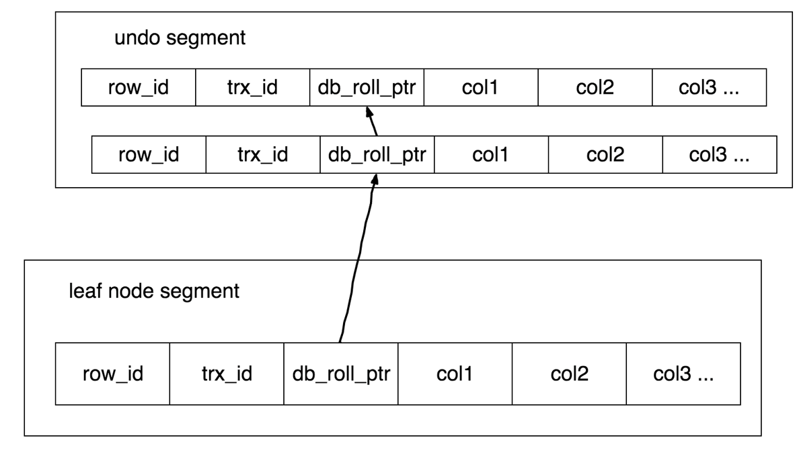

# mvcc

#### mvcc仅针对快照读

#### 只在RR和RC两个隔离级别下工作
+ RC: 每一次查询会生产一个read_view，导致有其他事务提交后，新查询能看到其他事务提交的数据
+ RR: 一个事务一个read_view，有其他事务提交，新查询还是通过老的read_view，来查看数据（可重复读）

#### 实现
+ 每行数据有一个回滚指针，指向上一次修改的数据，形成一个版本链（除了最新的数据在索引中，其他数据都在undo log中）
+ 通过在每行保存两个隐藏的列来实现（创建时间+删除时间）（时间不是真的时间，而是自增的系统版本号）
+ select：行版本号 < trx_id < 删除标识 
+ insert：为新插入的行保存当前系统版本号作为行版本号
+ delete：为删除的行保存当前系统版本号作为行删除标识
+ update：保存当前系统版本号作为行版本号，同时保存当前系统版本号到原来行作为行删除标识
+ 大多数读操作不需要加锁，但需要额外的存储空间及更多的检查工作，额外的维护工作

